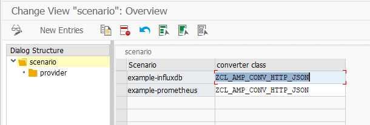

# framework

## customizing

transaction ZAMP_CONFIG




## compontent provider

### modul collector

## compontent scrapper

### modul converter

The converter get the scenario from the URL parameter `scenario`.
The URL should look like `http://vhcalnplci:8000/amp/metrics?sap-client=001&scenario=test`

# metrics

The collectors classes are marked with a C e.g. zcl_amp_c_runtime_errors.

## runtimte errors (ST22)

zcl_amp_c_runtime_errors

Selects all runtime errors from the table SNAP for the current Day.

```ABAP
    SELECT COUNT( * )
    INTO @DATA(number_of_runtime_errors)
    FROM snap
    WHERE datum = @sy-datum
    AND   seqno = '000'.

    metrics = VALUE #( BASE metrics ( metric_key = 'runtime_errors' metric_value = number_of_runtime_errors ) )
```

## jobs (SM37)

zcl_amp_c_jobs

Selects all jobs for the current Day and create a metric for each status.

```ABAP
    SELECT
    COUNT(*) AS count,
    status AS status
    FROM v_op
    INTO TABLE @DATA(jobs)
    WHERE strtdate = @sy-datum
    GROUP BY status.

    LOOP AT jobs ASSIGNING FIELD-SYMBOL(<job>).

      "status from include LBTCHDEF
      status = SWITCH #( <job>-status
                          WHEN 'R' THEN 'running'
                          WHEN 'Y' THEN 'ready'
                          WHEN 'P' THEN 'scheduled'
                          WHEN 'P' THEN 'intercepted'
                          WHEN 'S' THEN 'released'
                          WHEN 'A' THEN 'aborted'
                          WHEN 'F' THEN 'finished'
                          WHEN 'Z' THEN 'put_active'
                          WHEN 'X' THEN 'unknown_state'
                          ELSE 'no status found' ).

      metrics = VALUE #( BASE metrics ( metric_key = |jobs_{ status }| metric_value = <job>-count ) ).

    ENDLOOP.
```

## workloads (ST03N)

zcl_amp_c_workloads

Select the workload of the system.

```ABAP
    DATA no_of_records       TYPE sapwlsrirn.
    DATA normal_records      TYPE sapwlnormrecs.

    DATA response_time       TYPE p.
    DATA cpu_time            TYPE p.

    DATA tz TYPE timezone.

    CALL FUNCTION 'GET_SYSTEM_TIMEZONE'
      IMPORTING
        timezone = tz.

    CONVERT TIME STAMP last_run TIME ZONE tz
        INTO DATE DATA(date_last_run) TIME DATA(time_last_run).

    GET TIME STAMP FIELD DATA(timestamp_current).

    CONVERT TIME STAMP timestamp_current TIME ZONE tz
        INTO DATE DATA(date_current) TIME DATA(time_current).

    CALL FUNCTION 'SAPWL_STATREC_DIRECT_READ'
      EXPORTING
        read_start_date             = date_last_run
        read_start_time             = time_last_run
        read_end_date               = date_current
        read_end_time               = time_current
      IMPORTING
        records_read                = no_of_records
        normal_records              = normal_records
      EXCEPTIONS
        wrong_parameter_combination = 1
        file_problems               = 2
        convert_overflow            = 3
        OTHERS                      = 4.
    IF sy-subrc = 0.

      LOOP AT normal_records ASSIGNING FIELD-SYMBOL(<normal_record>).

        response_time  = response_time + <normal_record>-respti.
        cpu_time       = cpu_time + <normal_record>-cputi.

      ENDLOOP.

      metrics = VALUE #( BASE metrics
                          ( metric_key = 'workload_no_of_records' metric_value = no_of_records )
                          ( metric_key = 'workload_response_time' metric_value = response_time )
                          ( metric_key = 'workload_cpu_time' metric_value = cpu_time ) ).


    ELSE.
      ASSERT 1 = 2.
    ENDIF.
```
