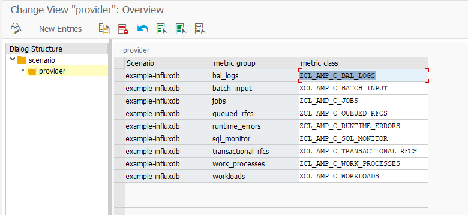

- [framework](#framework)
  - [customizing](#customizing)
  - [authorization checks](#authorization-checks)
  - [compontent provider](#compontent-provider)
    - [modul collector](#modul-collector)
  - [compontent scrapper](#compontent-scrapper)
    - [modul converter](#modul-converter)
- [metrics](#metrics)
  - [runtimte errors (ST22)](#runtimte-errors-st22)
  - [jobs (SM37)](#jobs-sm37)
  - [workloads (ST03N)](#workloads-st03n)
  - [SQL monitor data (SQLM)](#sql-monitor-data-sqlm)
  - [transactional RFCs (SM58)](#transactional-rfcs-sm58)
  - [queued RFCs (SMQ1/SMQ2)](#queued-rfcs-smq1smq2)
  - [transport states (STMS)](#transport-states-stms)
  - [Business Application Log (BAL)](#business-application-log-bal)
  - [Batch Input Jobs (SM35)](#batch-input-jobs-sm35)
  - [Batch Input Jobs (SM50/SM51)](#batch-input-jobs-sm50sm51)
# framework

## customizing

transaction ZAMP_CONFIG

## authorization checks

All checks are in class [zcl_amp_auth_checker](../src/zamp_collector/zcl_amp_auth_checker.clas.abap).

Checks are implemented for the provider, scraper and the deleting programm of the metrics store.

The authorization object `ZAMP_AUTH` is used in each case, with the field values `PROVIDER`, `SCRAPER`, `DELETER`.

## compontent provider

### modul collector

A collector is a class with the interface [zif_amp_collector](../src/zamp_collector/zif_amp_collector.intf.abap).

This classes can be assigned to a scenario.

## compontent scrapper

### modul converter

The converter get the scenario from the URL parameter `scenario`.
The URL should look like `http://vhcalnplci:8000/amp/metrics?sap-client=001&scenario=test`

All predefined converter are listed in this [UML](https://abaplint.app/rest/stats/abap-observability-tools/abap-metrics-provider/oo/ZIF_AMP_CONVERTER/uml).

# metrics

The collectors classes are marked with a C e.g. zcl_amp_c_runtime_errors.

All collectors are in this [UML](https://abaplint.app/rest/stats/abap-observability-tools/abap-metrics-provider/oo/ZIF_AMP_COLLECTOR/uml)

## runtimte errors (ST22)

[zcl_amp_c_runtime_errors](../src/zamp_collector/zcl_amp_c_runtime_errors.clas.abap)

Selects all runtime errors from the table SNAP for the current Day.

## jobs (SM37)

[zcl_amp_c_jobs](../src/zamp_collector/zcl_amp_c_jobs.clas.abap)

Selects all jobs for the current Day and create a metric for each status.

## workloads (ST03N)

[zcl_amp_c_workloads](../src/zamp_collector/zcl_amp_c_workloads.clas.abap)

Select the workload of the system.

## SQL monitor data (SQLM)

[zcl_amp_c_sql_monitor](../src/zamp_collector/zcl_amp_c_sql_monitor.clas.abap)

Selects the sum of total DB time for the top five statements in the last hour.

## transactional RFCs (SM58)

[zcl_amp_c_transactional_rfcs](../src/zamp_collector/zcl_amp_c_transactional_rfcs.clas.abap)

Selects the transactional RFCs for the current Day and create a metric for each status.

## queued RFCs (SMQ1/SMQ2)

[zcl_amp_c_queued_rfcs](../src/zamp_collector/zcl_amp_c_queued_rfcs.clas.abap)

Selects the queued RFCs (inbound and outbound) for the current Day and create a metric for each status.

## transport states (STMS)

[zcl_amp_c_transport_states](../src/zamp_collector/zcl_amp_c_transport_states.clas.abap)

Selects the transport states for the current Day and create a metric for command and return code.

## Business Application Log (BAL)

[zcl_amp_c_bal_logs](../src/zamp_collector/zcl_amp_c_bal_logs.clas.abap)

Counts all logs for the current day and groups by Object and Subobject. 
Also provides the number of different message types per Bal Object.

## Batch Input Jobs (SM35)

[zcl_amp_c_batch_input](../src/zamp_collector/zcl_amp_c_batch_input.clas.abap)

Collect count of batch sessions for the current day.

## Batch Input Jobs (SM50/SM51)

[zcl_amp_c_work_processes](../src/zamp_collector/zcl_amp_c_work_processes.clas.abap)

Collect count of all work process types of all servers
